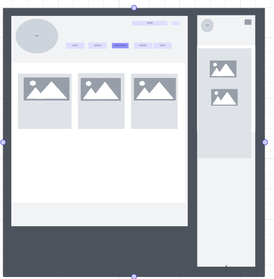

# CI-project-cookbook
django cookbook
Welcome to CookBook
Introduction
We know the deal. We feel your pain. Here are our superstar workhorse recipes, designed and tested to help you cook a great family meal.

Welcome to CookBook, a place where you can easily store, retrieve and edit your favourite recipes all in one place. This website is for anyone who loves to cook but doesn’t love wasting valuable cooking time searching for their favourite recipes.

[View the live project here](https://ci-project-cookbook-fe13e6be7172.herokuapp.com/)
Logo Created using canva: 

## User Stories
- As a site user, I can view a paginated list of posts so that I can select which post I want to view.
- As a user I can upload images of my recipies.
- As a Site User / Admin I can view different recipies to choose from.
- As a Site User, I can click on recipe link so that I can read the full recipe.
- As a Site User I can edit or delete my recipies on a post .
- As a user I want to mention meal type.
- As a user/Admin I want to search through the recipes.
- As Admin I want to create database and store information in there.
- As Owner of website I want to creat Logo.
- As owner I want to creat site map.

## Workflow
- Following diagram defines the worlflow of the website. 

## Kanban Board 

## User Experience (UX) 

 
- Simple navigation: A clear instruction to ensure a smooth user experience for all ages and skill levels.
- Responsive Design: Adapts to different devices, from smartphones to desktops, for accessibility and convenience to all users.
- Visually Appealing: Produce a modern, eye-catching aesthetic with a vibrant color scheme to keep users engaged throughout the quiz.
- Clear website and functional to not overwhelm the users.

## Models
- Django AllAuth User Model is used to creat a recipe Model with the following feilds: 

## Features and Design
- The start page offers a warm welcome message, clearly stating the website's purpose. 
 

 

 

- Once the user is logged in user can edit/delete his own recipes not the recipes belongs to others. 

- At the top right there is a search option.User caan search through the recipes using any keyword. 

 

- The responsive design ensures compatibility across all devices.

### Typography

Google Fonts Garamons ,serif, Roboto were used. These selections were made for their compatibility, simplicity, and user-friendly appearance. They ensure readability and a clear design across all tested screen sizes.

### Color Scheme
Selected soothing and light colours to which make the website welcoming. 

### Wireframes

Lo fidelity initial wireframes: 

Hi fidelity wireframes were created in Figma for mobile, table and desktop versions. 

  - The desktop versions and mobile version: 

### Technologies Used
- [HTML5](https://en.wikipedia.org/wiki/HTML5)
- [CSS3](https://en.wikipedia.org/wiki/Cascading_Style_Sheets)
- [JS](https://en.wikipedia.org/wiki/JavaScript)
- [Python](https://en.wikipedia.org/wiki/Python_(programming_language))
- [Google Fonts](https://fonts.google.com/) EB Garamond were used for the project.
- [Git](https://git-scm.com/) Git version control via the Gitpod terminal was used by committing changes and pushing them to GitHub.
- [GitHub](https://github.com/) Serves as the repository for the project's code and Agile Methodology.
- [Lucid ](https://lucid.co/) Used to create wireframes during the design process.
- [Bootstrap](https://getbootstrap.com/) Used to create the responsive layout.
- [Django:](https://www.djangoproject.com/) Used to create the responsive layout.
- [Cloudinary](https://cloudinary.com/?utm_campaign=1329&utm_content=instapagelogocta-selfservetest)
- [PostgreSQL](https://www.postgresql.org/)

### Validator Testing 

- HTML
  - No errors were returned when passing through the official [W3C validator](https://validator.w3.org/) 

 

- CSS
  - No errors were found when passing through the official [(Jigsaw) validator](https://jigsaw.w3.org/css-validator/) 

  

- JS
  - No errors were found when passing through the official [(JSHint) validator](https://jshint.com/)

  - There are 33 known ES6-related warnings. However, no action is required for these warnings. 

   

- Lighthouse Performnce 
  

## Testing 

Screen size reflector used to ensure Desktop Monitors, Tablets and Mobile Phone screen sizes are accomodated.

The below shows a mobile screen size and how it looks on there. 
- 

The next image is of desktop and laptop responsive site. 
-  

- 

### Unfixed Bugs
- Not fully responsive in 3200x2000 resolution.

### Future UX Considerations
- adding the videos to the recipes.
- making search more specific like meal type, time or method wise.

## Deployment

- The site was deployed to Heroku 

The live link can be found here - (https://ci-project-cookbook-fe13e6be7172.herokuapp.com/)

## Credits 

- Google Fonts were used for the project.
- Lucid is used to create wireframes during the design process and flowchart creation(https://lucid.co/)
- Logo Created using canva(https://www.canva.com/)
- This video helped us to inspire the logic :(https://www.youtube.com/watch?v=sBjbty691eI&list=PLXuTq6OsqZjbCSfiLNb2f1FOs8viArjWy)
- Chat GPT was utilised to generate content.
- Content and picture are used from this website :(https://www.simplyrecipes.com/recipes-5090746)
- Thanks to all the members of Bootcamp for the technical and moral support.

  

## Future Features
- add videos to the recipes 
- add search option with specific requirment like mealtype, cooking Method or time.

 