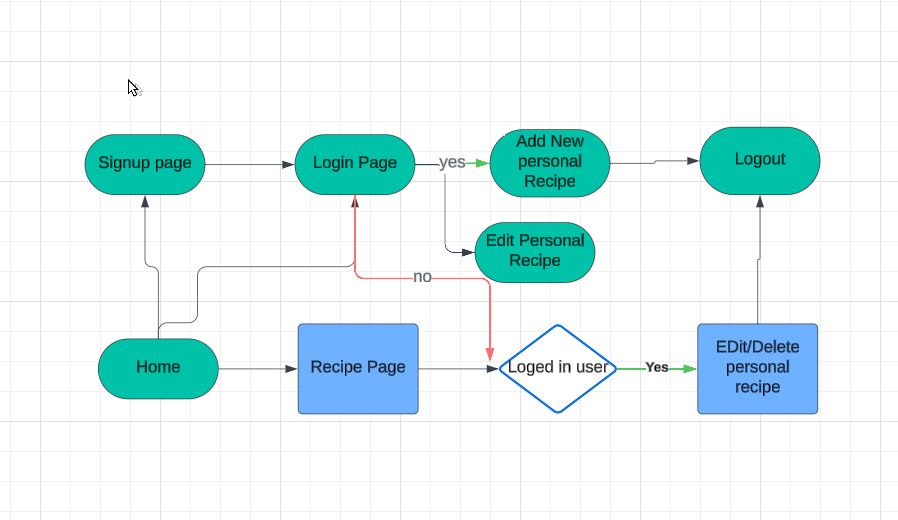
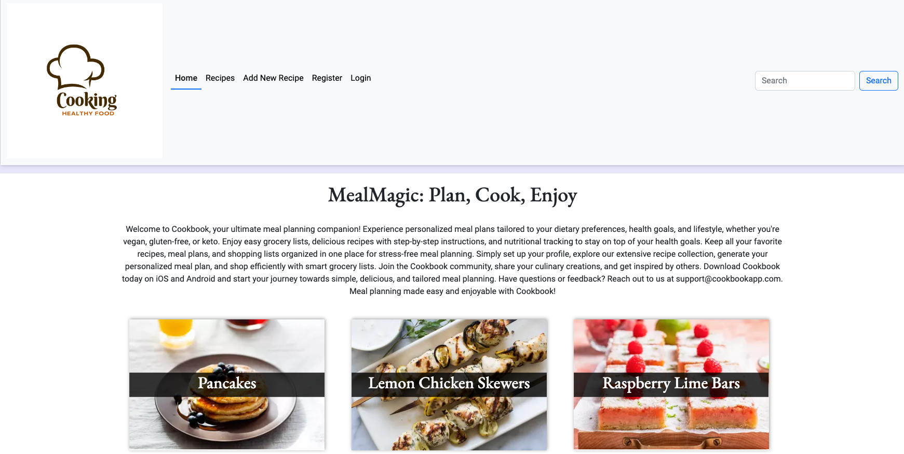
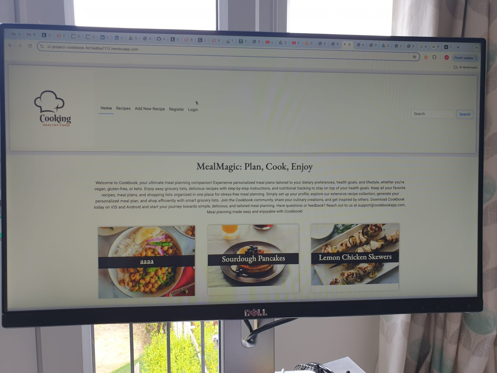

# CookBook

<h2>Welcome to CookBook</h2> 
<h3>A Recipe Website</h3> 
We know the deal. We feel your pain. Here are our amazing recipes, designed and tested to help you cook a great family meal.

Cookbook is a place where you can easily store, retrieve and edit your favourite recipes all in one place. This website is for anyone who loves to cook but dosen't have time for searching  their favourite recipes.

[View the live project here](https://ci-project-cookbook-fe13e6be7172.herokuapp.com/) 
 

## Am I Responsive? 
- How this project looks on different devices!

Logo Created using canva: 

## Kanban Board 
 
[Link to Project Board](https://github.com/users/NeeruRathour/projects/5) 
 

## User Stories 
- As a site user, I can view a paginated list of posts so that I can select which post I want to view.
- As a user I can upload images of my recipies.
- As a Site User / Admin I can view different recipies to choose from.
- As a Site User, I can click on recipe link so that I can read the full recipe.
- As a Site User I can edit or delete my recipies.
- As a user I want to mention meal type.
- As a user/Admin I want to search through the recipes.
- As Admin I want to create database and store information in there.
- As Owner of website I want to creat Logo.
- As owner I want to creat site map.

## MoSCoW implementation 

## Workflow
- Following diagram defines the worlflow of the website. 

## User Experience (UX) 
 
- Simple navigation: A clear instruction to ensure a smooth user experience for all users.
- Responsive Design: Adapts to different devices, from smartphones to desktops, for accessibility and convenience to all users.
- Visually Appealing: Produce a modern, soothing color scheme to keep users engaged throughout the website.
- Clear website and functional to not overwhelm the users.

## Models
- Django AllAuth User Model is used to creat a recipe Model with the following feilds: 

## Features and Design 

- The start page offers a warm welcome message, clearly stating the website's purpose. 
- show some recipes to visitor to choose one from.

 

- Sign in Page 
- User sign in here to add, update or delete the recipe. 
 

- Signup Page 
- User need to signup to add a new resipe to the website. 
 

- Once the user is logged in user can edit/delete his own recipes not the recipes belongs to others. 

 

- At the top right there is a search option.User can search through the recipes using any keyword. 

 

### Typography

- Google Fonts Garamons ,serif, Roboto were used. These selections were made for their compatibility, simplicity, and user-friendly appearance. They ensure readability and a clear design across all tested screen sizes.

### Wireframes

Lo fidelity initial wireframes: 

CookBook Recipes website is designed with Bootstrap to ensure responsiveness, making it accessible on mobile, tablet, and desktop devices

Balsamiq is used to create the wireframes. They were served as initial thnking and evolved during the build in line with Agile methodology.

- Home Page 

- Mobile Home Page 

- View Recipes Page 

- Recipes Page 

### Technologies Used
- [HTML5](https://en.wikipedia.org/wiki/HTML5) Used for page structure.
- [CSS3](https://en.wikipedia.org/wiki/Cascading_Style_Sheets)Used for custom styling.
- [JS](https://en.wikipedia.org/wiki/JavaScript) used for event listeners on buttons.
- [Python](https://en.wikipedia.org/wiki/Python_(programming_language)) used as main programming language in this project.
- [Google Fonts](https://fonts.google.com/) EB Garamond were used for the project.
- [Git](https://git-scm.com/) Git version control via the Gitpod terminal was used by committing changes and pushing them to GitHub.
- [GitHub](https://github.com/) Serves as the repository for the project's code and Agile Methodology.
- [Lucid ](https://lucid.co/) Used to create wireframes during the design process.
- [Bootstrap](https://getbootstrap.com/) Used to create the responsive layout.
- [Django:](https://www.djangoproject.com/) Used to create the responsive layout.
- [Cloudinary](https://cloudinary.com/?utm_campaign=1329&utm_content=instapagelogocta-selfservetest) Used to upload images for the website.
- [PostgreSQL](https://www.postgresql.org/)Used as database for the website.

### Validator Testing  

## Python
I used the CI Python Linter to check my Python files and addressed all the errors. The code now passes all checks successfully.

I checked homepage, welcome page, sign in, sign out, sign up, recipe list, view recipe, edit recipe, preview recipe, create recipe, search, my recipes, delete recipe.
- views.py

- models.py

- admin.py

- forms.py

## JS
- I used the JS Hint Validator to check my JS code. I used java script in pop-up-messages like successful log in , logout,updated or deleted recipe.

##  HTML 
  - No errors were returned when passing through the official [W3C validator](https://validator.w3.org/) 

 

##  CSS 
  - No errors were found when passing through the official [(Jigsaw) validator](https://jigsaw.w3.org/css-validator/) 

  

##  Manual testing

## Account registration & authentication tests

| Test                                       | Result |
|--------------------------------------------|--------|
| User can create an account                 | Pass   |
| User can log into profile                  | Pass   |
| User can log out of profile                | Pass   |
| Welcome name displays after registration   | Pass   |
| User redirected to main page after log in  | Pass   |

## User navigation tests

| Test                                             | Result |
|--------------------------------------------------|--------|
| User can easily navigate through the site        | Pass   |
| User can access the homepage                     | Pass   |
| User can access the recipe page                  | Pass   |
| User can log into there account                  | Pass   |
| User can register a new account.                 | Pass   |
| User can access the recipes page created earlier | Pass   |
| User can search for recipes using the search bar | Pass   |
| User can navigate to social links                | Pass   |

## Recipe management tests - CRUD functionality

| Test                                                       | Result |
|------------------------------------------------------------|--------|
| User can create a new recipe                               | Pass   |
| User can edit a recipe they created                        | Pass   |
| User can delete a recipe they created                      | Pass   |
| User can edit and delete his own recipe only               | Pass   |
| User can see new recipe on a page with all their recipes   | Pass   |

## Javascript pop up message test
|Test                                                         | Result |
|-------------------------------------------------------------|--------|
| Pop up message shows when user is logged in successfully.   | Pass   |
| Pop up message shows when user is loggedout successfully.   | Pass   |
| Pop up message shows when  new recipe is added.             | Pass   |
| Pop up message shows when recipe is edited.                 | Pass   |
| Pop up message shows when recipe is deleted.                | Pass   |

## Administrative controls tests

| Test                                                                 | Result |
|----------------------------------------------------------------------|--------|
| Admin can create, view, update, and delete any recipe via admin panel| Pass   |

- Lighthouse Performnce 
  

## Testing 

Screen size reflector used to ensure Desktop Monitors, Tablets and Mobile Phone screen sizes are accomodated.

- Image is of phone responsive site. 
-  

- Image is of desktop  responsive site. 
-  

- Image is of laptop responsive site. 
- 

## Deployment 

- This project was deployed using GitHub and Heroku. 

The live link can be found here - (https://ci-project-cookbook-fe13e6be7172.herokuapp.com/)

### **GitHub**

- Start a new repository.
   - Log in to GitHub.
   - Click the blue book icon.
   - Choose a template .
   - Add a repository name and click "Create repository" at the bottom of the page.
   - Then, click the Gitpod button.

### **Gitpod and Django**

- Install Django and other necessary libraries:
   - Use `pip install Django` to install Django.
   - Install any other required libraries.
- Write your code.
- Create a `.env` file for sensitive data and add it to the `.gitignore` file to prevent it from being publicly accessible.
- Generate a `requirements.txt` file by running `pip3 freeze --local > requirements.txt`.
- Create a `Procfile`.

### **Heroku**

- Log in to Heroku.
- Click the "New" button, then select "New app".
- Choose a unique app name and region, then click "Create app".
- Go to "Settings" and click "Reveal Config Vars". Here, enter all the sensitive data, database addresses, and other URLs used in the project.
- Go back to the top and click on "Deploy", then select "GitHub".
- Scroll down and click on "Connect to GitHub".
- Search for your GitHub repository name by typing it in the search field.
- Click on "Connect".
- Scroll down and click on "Deploy Branch".
- Once the app is built with Python and all the dependencies, you'll see a message that says "The app was successfully deployed".
- Click on "View" to see the [deployed site](https://ci-project-cookbook-fe13e6be7172.herokuapp.com/).

## Credits 

- Balsamiq is userd for wireframes(https://balsamiq.com/)
- Lucid is used to create wireframes during the design process and flowchart creation(https://lucid.co/)
- Logo Created using canva(https://www.canva.com/)
- This video helped us to inspire the logic :(https://www.youtube.com/watch?v=sBjbty691eI&list=PLXuTq6OsqZjbCSfiLNb2f1FOs8viArjWy)
- Chat GPT was utilised to generate content.
- Content and picture are used from this website :(https://www.simplyrecipes.com/recipes-5090746)
- Thanks to all the members of Bootcamp for the technical and moral support.

  

## Future Features
- add videos to the recipes 
- add search option with specific requirment like mealtype, cooking method or time.

 